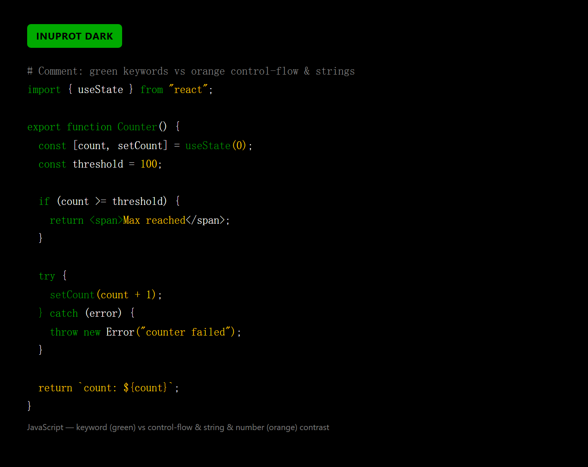
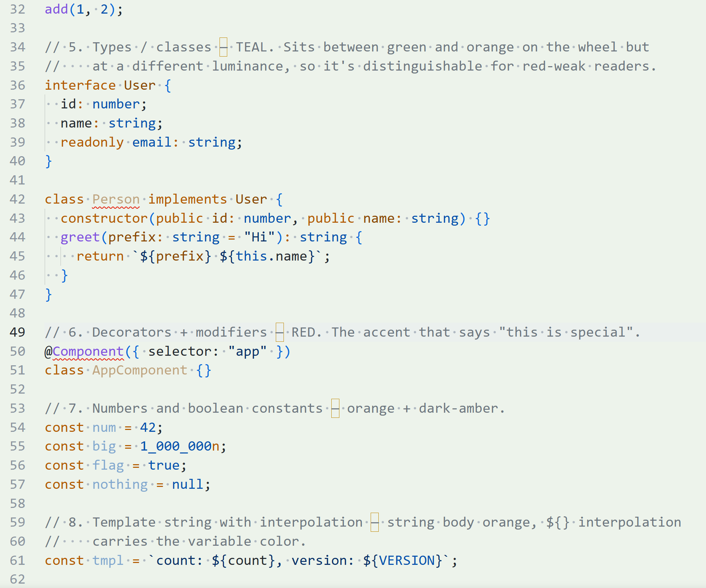

# InuProt

A two-variant colour scheme pack, published for **Visual Studio Code** and
**Sublime Text**.

## Who this is for

InuProt is tuned for **readers with red-green color vision deficiencies**
(red-green color blindness), specifically:

- **Protanomaly / protanopia** — red-weak or red-blind vision
- **Deuteranomaly / deuteranopia** — green-weak or green-blind vision
- Anyone whose eyes find saturated neon greens painful or hard to read

In typical syntax themes the *keyword green* and the *control-flow / string /
number orange* sit close in both hue and luminance, so they merge for these
readers. InuProt fixes that pairing: the green ramp is dimmed away from the
orange in the dark variant, and the light variant uses a green-tinted chrome
that stays distinguishable.

> If you searched for *colorblind theme*, *protanopia theme*, *red-green
> colorblind color scheme*, *high-contrast accessible VS Code theme*, or
> *accessible Sublime Text theme* — this project is for you.

Keywords: colorblind, colorblind-friendly, protanopia, protanomaly,
deuteranopia, deuteranomaly, red-green color vision deficiency, accessible,
accessibility, high contrast, VS Code theme, Sublime Text color scheme.

---

## Variants

| Variant        | Surface       | Origins                                                            |
|----------------|---------------|-------------------------------------------------------------------|
| **InuProt Dark**  | black + ink-green   | Forked from [Human High Contrast](https://github.com/tom-f-hall/human-theme-vscode) by Tom Hall, with the green ramp dimmed for better separation from the orange control-flow / string color. |
| **InuProt Light** | soft green tint     | Forked from **GitHub Light Colorblind (Beta)** (`primer/github-vscode-theme`, MIT), with the editor surface retinted to `#edf3eb` and chrome to `#e6eee4`; syntax token colors are inherited unchanged (the upstream theme is already tuned for colorblind accessibility). |

> **About the name.** *Prot* stands for **Protanomaly** (red-weak color
> vision deficiency). People with protanomaly — and the more general category
> of deuteranomaly / red-green color blindness — have trouble distinguishing
> green from orange/red. Two of the most important colors in almost every code
> syntax theme are *green* (keywords) and *orange/yellow* (control-flow +
> strings + numbers). When those two sit close together in hue and luminance,
> they merge for protanopic readers. InuProt exists specifically to separate
> them: the Dark variant dims the green ramp away from the orange, and the
> Light variant uses a soft green-tinted chrome that stays distinguishable.
> The accompanying *Inu* prefix is the Japanese 犬 ("dog") — a small nod to
> its🐾 pedigree (an Inu watches over what it keeps close).

---

## What changed from upstream?

### InuProt Dark (from Human High Contrast)
Only the **green ramp** was retuned, to lower its luminance away from the
orange/yellow control-flow + string color. Source changes are in
[`source/changes-dark.md`](source/changes-dark.md); in short:

| Token role            | Before      | After       |
|-----------------------|-------------|-------------|
| keywords / cursor / button   | `#00FF00` | `#00AA00` |
| function names / gutter added| `#00EE00` | `#009900` |
| git untracked / hint         | `#00DD00` | `#008800` |

Everything else (UI chrome, terminal ANSI, token rules) is unchanged.

### InuProt Light (from GitHub Light Colorblind)
Only **background surfaces** were retinted to a soft green. Syntax token colors
are inherited unchanged from GitHub Light Colorblind. Source changes are in
[`source/changes-light.md`](source/changes-light.md); in short:

| Surface                              | Before      | After       |
|--------------------------------------|-------------|-------------|
| editor / gutter / active tab         | `#FFFFFF` | `#edf3eb` |
| sideBar / activityBar / statusBar / panel / titleBar / tab inactive / widgets | `#FAFAFD` | `#e6eee4` |
| sticky hover / no-folder status      | `#F0F0F3` | `#dfe7dd` |

`input.background` and `dropdown.background` stay `#FFFFFF` so white controls
still read cleanly on the green chrome.

---

## Previews

| InuProt Dark | InuProt Light |
|--------------|---------------|
|  |  |

> Captured manually from real VS Code. To update: open
[`previews/inuprot-preview-sample.ts`](previews/inuprot-preview-sample.ts) with the
theme active, screenshot, and replace the PNGs.

## Install

### Visual Studio Code

```bash
code --install-extension ./vscode/inuprot-1.0.5.vsix
```

Or use the Command Palette → **Preferences: Color Theme** → **InuProt Dark**
or **InuProt Light**.

### Sublime Text

Copy the two files in `sublime/` into your Packages/User directory:

- `sublime/InuProt Dark.sublime-color-scheme`
- `sublime/InuProt Light.sublime-color-scheme`
- (legacy) `sublime/InuProt Dark.tmTheme` / `sublime/InuProt Light.tmTheme`

Then in `Preferences.sublime-settings`:

```jsonc
{
  "color_scheme": "InuProt Dark.sublime-color-scheme",
  "dark_color_scheme": "InuProt Dark.sublime-color-scheme",
  "light_color_scheme": "InuProt Light.sublime-color-scheme",
}
```

---

## Project layout

```
InuProt/
├── vscode/                 # VS Code extension (packaged as vsix)
│   ├── package.json
│   ├── .vscodeignore
│   └── themes/
│       ├── inuprot-dark.json
│       └── inuprot-light.json   (+ light_modern/plus/vs from upstream, for include)
├── sublime/
│   ├── InuProt Dark.sublime-color-scheme   # modern format (preferred)
│   ├── InuProt Light.sublime-color-scheme
│   ├── InuProt Dark.tmTheme                # legacy TextMate format
│   └── InuProt Light.tmTheme
└── source/                 # build scripts
    ├── vscode_to_tmtheme.py
    └── vscode_to_sublime_colorscheme.py
```

The `source/` directory contains the converters used to flatten VS Code's
theme JSON (resolving its include chain) into self-contained Sublime color
scheme files.

---

## Attribution & Licenses

This project is MIT-licensed. Both upstreams are also MIT-licensed, which
permits modification and redistribution provided the original notices are
retained. See [`LICENSE`](LICENSE) and [`THIRD_PARTY_NOTICES.md`](THIRD_PARTY_NOTICES.md)
for the full notices.

- **Human Theme** (InuProt Dark upstream)
  © Tom Hall, MIT License. https://github.com/tom-f-hall/human-theme-vscode
- **GitHub VS Code Theme** (InuProt Light upstream, GitHub Light Colorblind)
  © Primer / GitHub, MIT License. https://github.com/primer/github-vscode-theme